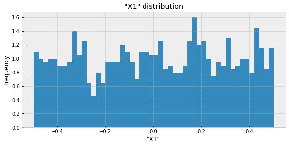

# Bayesian Causal Graphs - BCG
> Playing with Bayesian Causal Graphs.


The main references have so far been the following:

**References**

References for the dowhy package:
* Documentation: [here](https://microsoft.github.io/dowhy/)
* GitHub: [here](https://github.com/microsoft/dowhy)

Material which helped my introductory reading so far by :
* degeneratestate.org: [Pt I - potential outcomes](http://www.degeneratestate.org/posts/2018/Mar/24/causal-inference-with-python-part-1-potential-outcomes/) (contains definitions of ATE, ATT and ATC, among other things)
* degeneratestate.org: [Pt II - causal graphs & the backdoor criterion](http://www.degeneratestate.org/posts/2018/Jul/10/causal-inference-with-python-part-2-causal-graphical-models/)
* this youtube video [on backdoor paths](https://www.youtube.com/watch?v=F8vcki-uWJc) 
* Rubin et al. 2005 on [causal inference and potential outcomes](http://www.stat.unipg.it/stanghellini/rubinjasa2005.pdf)
* wiki article on the [average treatment effect (ATE)](https://en.wikipedia.org/wiki/Average_treatment_effect)
* this wiki article [on propensity score matching](https://en.wikipedia.org/wiki/Propensity_score_matching) 

**Brief list of concepts I found useful**:
* at the center of interest is the calculation of *potential outcomes* / *counterfactuals* $\rightarrow$ what Y would have been if X would have been different (so everything after all observations are done) $\rightarrow$ so we may want to know if a certain drug was taken or a placebo and measure the difference in effect
* potential outcomes and counterfactuals can be seen as being the same thing, see [Rubin et al. 2005](http://www.stat.unipg.it/stanghellini/rubinjasa2005.pdf) (really more of a useful thing know when reading the literature - man was I confused before knowing this)
* potential outcomes can be calculated without using a graphical model but graphical models help by guiding which variables should be conditioned on legally
* graphical models themselves require justification

**Technical note**:
In order to run this notebook, you'll need a symbolic link from `/notebooks/bcg` to `./bcg`.

## Small example using $ Y = a \cdot X_0 ^ b + c + X_1 $ to generate observations

```python
n = 1000
a,b,c = 1.5, 1., 0
target = 'Y'
obs = pd.DataFrame(columns=['X0', 'X1', target])
obs['X0'] = stats.uniform.rvs(loc=-1, scale=2, size=n)
# obs['X1'] = stats.norm.rvs(loc=0, scale=.1, size=n)
obs['X1'] = stats.uniform.rvs(loc=-.5, scale=1, size=n)
obs[target] = a * obs.X0 ** b + c + obs.X1

obs.head()
```


<div>
<style scoped>
    .dataframe tbody tr th:only-of-type {
        vertical-align: middle;
    }

    .dataframe tbody tr th {
        vertical-align: top;
    }

    .dataframe thead th {
        text-align: right;
    }
</style>
<table border="1" class="dataframe">
  <thead>
    <tr style="text-align: right;">
      <th></th>
      <th>X0</th>
      <th>X1</th>
      <th>Y</th>
    </tr>
  </thead>
  <tbody>
    <tr>
      <th>0</th>
      <td>-0.806061</td>
      <td>0.370908</td>
      <td>-0.838184</td>
    </tr>
    <tr>
      <th>1</th>
      <td>0.667759</td>
      <td>0.228029</td>
      <td>1.229667</td>
    </tr>
    <tr>
      <th>2</th>
      <td>0.158370</td>
      <td>0.352362</td>
      <td>0.589917</td>
    </tr>
    <tr>
      <th>3</th>
      <td>0.103955</td>
      <td>-0.018955</td>
      <td>0.136977</td>
    </tr>
    <tr>
      <th>4</th>
      <td>-0.755793</td>
      <td>-0.387319</td>
      <td>-1.521008</td>
    </tr>
  </tbody>
</table>
</div>


### Inspecting the observed data

```python
plot_target_vs_rest(obs)
```


```python
plot_var_hists(obs)
```





```python
show_correlations(obs)
```


## Generating the probably simplest possible causal graphical model

```python
gg = GraphGenerator(obs)
print(f'target var: {gg.target}, not target vars: {", ".join(gg.not_targets)}')
```

    target var: Y, not target vars: X0, X1


```python
g = gg.get_only_Xi_to_Y()
gml = gg.get_gml(g)
```

```python
gg.vis_g(g)
```


```python
treatment = ['X0', ] # 'X1'
causal_model = dw.CausalModel(data=obs,  treatment=treatment, 
                              outcome=target, graph=gml)
```

    INFO:dowhy.causal_graph:If this is observed data (not from a randomized experiment), there might always be missing confounders. Adding a node named "Unobserved Confounders" to reflect this.
    INFO:dowhy.causal_model:Model to find the causal effect of treatment ['X0'] on outcome ['Y']


Note how `CausalModel` added an unobserved confounder variable `U`

```python
causal_model.view_model()
```

    WARNING:dowhy.causal_graph:Warning: Pygraphviz cannot be loaded. Check that graphviz and pygraphviz are installed.
    INFO:dowhy.causal_graph:Using Matplotlib for plotting


### Identifying the estimant

```python
identified_estimand = causal_model.identify_effect(proceed_when_unidentifiable=True)
print(identified_estimand)
```

    INFO:dowhy.causal_identifier:Common causes of treatment and outcome:['U']
    WARNING:dowhy.causal_identifier:If this is observed data (not from a randomized experiment), there might always be missing confounders. Causal effect cannot be identified perfectly.
    INFO:dowhy.causal_identifier:Continuing by ignoring these unobserved confounders because proceed_when_unidentifiable flag is True.
    INFO:dowhy.causal_identifier:Instrumental variables for treatment and outcome:[]


    Estimand type: nonparametric-ate
    ### Estimand : 1
    Estimand name: backdoor
    Estimand expression:
      d                  
    ─────(Expectation(Y))
    d[X₀]                
    Estimand assumption 1, Unconfoundedness: If U→{X0} and U→Y then P(Y|X0,,U) = P(Y|X0,)
    ### Estimand : 2
    Estimand name: iv
    No such variable found!
    


### Computing the causal treatment estimate

```python
method_name = 'backdoor.linear_regression'

effect_kwargs = dict(
    method_name=method_name,
    control_value = 0,
    treatment_value = 1,
    target_units = 'ate',
    test_significance = True
)
causal_estimate = causal_model.estimate_effect(identified_estimand,
                                        **effect_kwargs)
```

    INFO:dowhy.causal_estimator:INFO: Using Linear Regression Estimator
    INFO:dowhy.causal_estimator:b: Y~X0+X0*X1


```python
print(causal_estimate)
```

    *** Causal Estimate ***
    
    ## Target estimand
    Estimand type: nonparametric-ate
    ### Estimand : 1
    Estimand name: backdoor
    Estimand expression:
      d                  
    ─────(Expectation(Y))
    d[X₀]                
    Estimand assumption 1, Unconfoundedness: If U→{X0} and U→Y then P(Y|X0,,U) = P(Y|X0,)
    ### Estimand : 2
    Estimand name: iv
    No such variable found!
    
    ## Realized estimand
    b: Y~X0+X0*X1
    ## Estimate
    Value: 1.4816271269256485
    
    ## Statistical Significance
    p-value: <0.001
    


### Trying to poke holes into the causal treatment effect

```python
method_name = 'placebo_treatment_refuter'

refute_kwargs = dict(
    method_name=method_name,
    placebo_type = "permute",  # relevant for placebo refutation
)

refute_res = causal_model.refute_estimate(identified_estimand, 
                                   causal_estimate, 
                                   **refute_kwargs)
```

    INFO:dowhy.causal_estimator:INFO: Using Linear Regression Estimator
    INFO:dowhy.causal_estimator:b: Y~placebo+placebo*X1


```python
print(refute_res)
```

    Refute: Use a Placebo Treatment
    Estimated effect:(1.4816271269256485,)
    New effect:(0.10464178347001926,)
    

